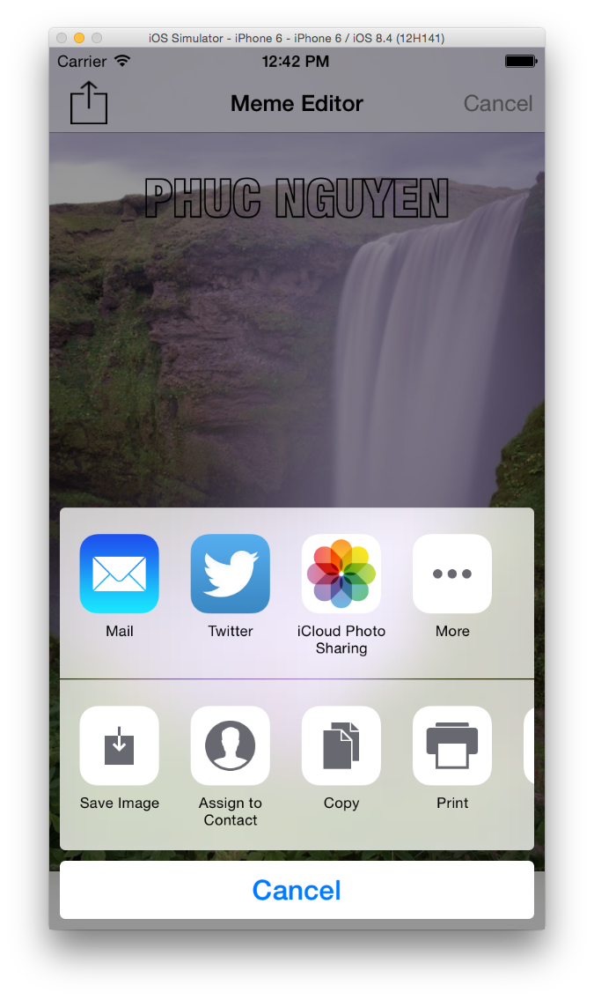
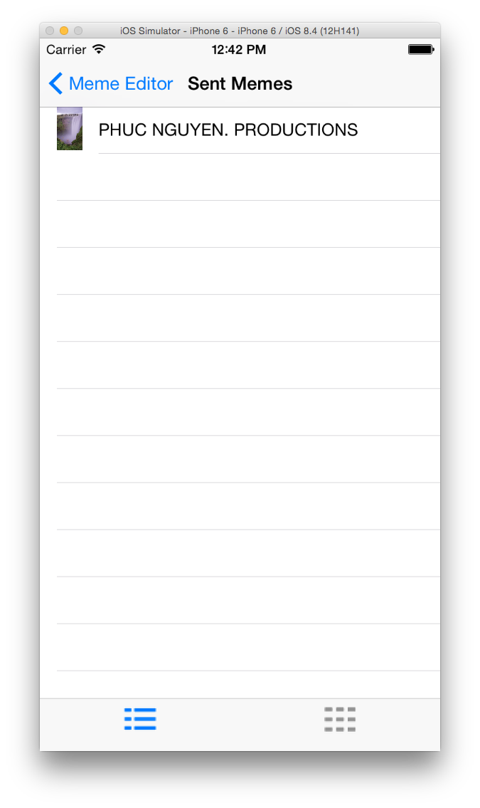
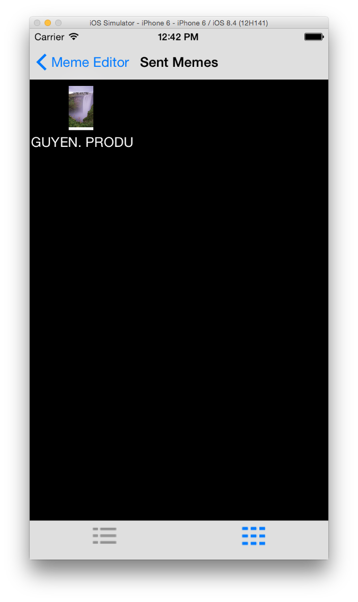

MEME APP
=================

# App Screenshot

# Description
MemeMe is a meme­generating app that enables a user to attach a caption to a picture from their phone. After adding text to an image chosen from the Photo Album or Camera, the user can share it with friends. MemeMe also temporarily stores sent memes which users can browse in a table or a grid.