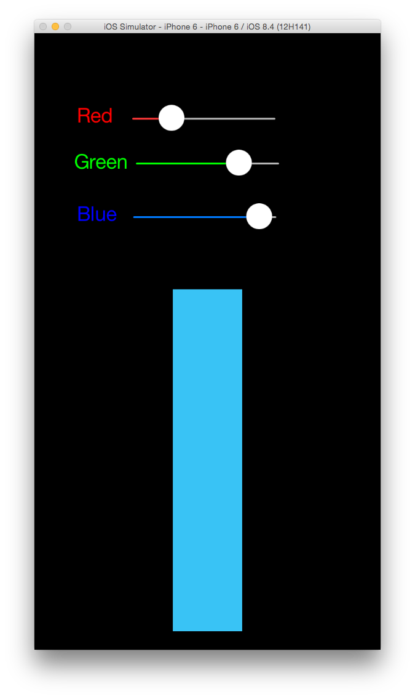

# Udacity iOS UIKit Fundamentals Summer 2015
## Some apps I made in this course

### 1. Color Maker with Slider

 [Project Link](My\ Projects/ColorMakerWithSlider/)

### 2. Rock Paper Scissors

 [Project Link](My\ Projects/RockPaperScissors/)

### 3. Text Field Challenge

 [Project Link](My\ Projects/TextFieldChallengeApp/)

### 4. Rock Paper Scissors with History

 [Project Link](My\ Projects/RoshamboWithHistory/)

### 4. Adventures

 [Project Link](My\ Projects/MYOA-Data-Driven/)

